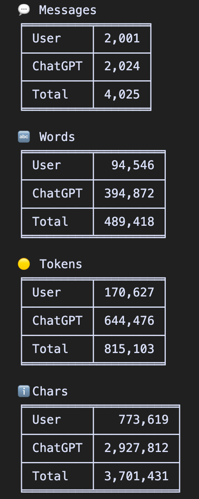

# ChatGPTMessageStats
A Python script that counts your messages on ChatGPT, returning the total number of messages, words, tokens, and characters.

## Installation
Clone the repository:
```bash
git clone https://github.com/lengvietcuong/chatgpt-message-stats.git
```
Install requirements using
```bash
pip install -r requirements.txt
```

## How to download your ChatGPT data
1. Go to https://chat.openai.com.
2. Click on your profile (bottom-left corner).
3. Settings -> Data controls -> Export data -> Export -> Confirm export.
4. Check your email inbox for the download link.

## Usage
1. Move your downloaded data file to the `data` folder in the project directory (no need to unzip).
2. Run `counter.py` and enjoy!

